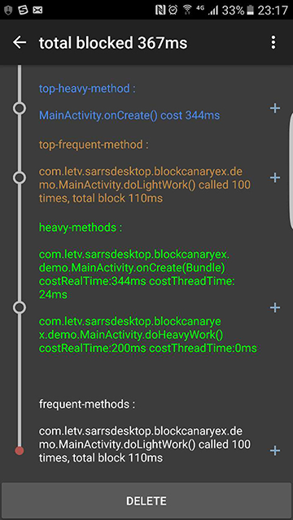

[中文文档](https://github.com/lqcandqq13/BlockCanaryEx/blob/master/README_CN.md)<br/>

BlockCanaryEx
=============
a library for android which can help you to find the most heavy method in your code when your app blocked,
base on [BlockCanary](https://github.com/markzhai/AndroidPerformanceMonitor).



What's the difference between BlockCanaryEx and BlockCanary
-------------
- BlockCanaryEx java runtime code are modified form BlockCanary, ui and features are mostly same;
- BlockCanaryEx add MethodSampler, knows every method's execute info (like cost-time, called-times...) when blocked;
- BlockCanaryEx focus on the method which cost most of time when your app blocked, and display it directly to developer.

Download
-------------
root build.gradle
```groovy
buildscript {
    repositories {
        jcenter()
    }
    dependencies {
        classpath 'com.android.tools.build:gradle:1.5.0' //version must >= 1.5.0
        classpath 'com.letv.sarrsdesktop:BlockCanaryExPlugin:0.9.3.1'
    }
}
```
model build.gradle
```groovy
apply plugin: 'blockcanaryex'
```

```groovy
compile 'com.letv.sarrsdesktop:BlockCanaryExJRT:0.9.3.2'
```

Basic Usage
-------------

init BlockCanaryEx when your application created

```java
public class TestApplication extends Application {
    @Override
    public void onCreate() {
        super.onCreate();
        if(BuildConfig.DEBUG) {
            //we don't suggest use BlockCanaryEx on release version
            //TODO add no-op version BlockCanaryEx
            BlockCanaryEx.install(new Config(this));
        }
    }
}
```

done, now BlockCanaryEx be enabled when you app in debug mode.

Advance Usage
-------------

BlockCanaryEx do method sample by inject MethodSampler into your code when compile time,
the scope to inject MethodSampler is the src of your project and subProject by default.
projectLocalDep, subProjectLocalDep, externalLibraries is ignored. If you want to change
the scope to watch more method performance, you can do the config in gradle.

```groovy
  apply plugin: 'blockcanaryex'

  block {
      debugEnabled true //enable MethodSampler when debug mode, default true
      releaseEnabled false //enable MethodSampler when release mode, default false
      excludePackages [] //exclude the package you don't want to inject MethodSampler, eg: ['com.android', 'android.support']
      excludeClasses [] //exclude the class you don't want to inject MethodSampler
      includePackages [] //only include the package you want to inject MethodSampler, packages which don't included will not be injected

      scope {
          project true //inject MethodSampler for app project, default true
          projectLocalDep false //inject MethodSampler for app libs(eg: .jar), default false
          subProject true //inject MethodSampler for subProject of app project, default true
          subProjectLocalDep false //inject MethodSampler for subProject libs, default false
          externalLibraries false //inject MethodSampler external libs, default false
      }
  }
 ```

you also can override more Config method to customize BlockCanaryEx runtime

```java
  public class TestApplication extends Application {
      @Override
      public void onCreate() {
          super.onCreate();
          BlockCanaryEx.install(new Config(this) {
              /**
               * provide the looper to watch, default is Looper.mainLooper()
               *
               * @return the looper you want to watch
               */
              public Looper provideWatchLooper() {
                  return Looper.getMainLooper();
              }

              /**
               * If need notification to notice block.
               *
               * @return true if need, else if not need.
               */
              public boolean displayNotification() {
                  return true;
              }

              /**
               * judge whether the loop is blocked, you can override this to decide
               * whether it is blocked by your logic
               *
               * Note: running in none ui thread
               *
               * @param startTime in mills
               * @param endTime in mills
               * @param startThreadTime in mills
               * @param endThreadTime in mills
               * @return true if blocked, else false
               */
              public boolean isBlock(long startTime, long endTime, long startThreadTime, long endThreadTime) {
                  long costRealTime = endTime - startTime;
                  return costRealTime > 100L && costRealTime < 2 * (endThreadTime - startThreadTime);
              }

              /**
               * judge whether the method is heavy method, we will print heavy method in log
               *
               * Note: running in none ui thread
               *
               * @param methodInfo {@link com.letv.sarrsdesktop.blockcanaryex.jrt.MethodInfo}
               * @return true if it is heavy method, else false
               */
              public boolean isHeavyMethod(com.letv.sarrsdesktop.blockcanaryex.jrt.MethodInfo methodInfo) {
                  return methodInfo.getCostThreadTime() >= 1L;
              }

              /**
               * judge whether the method is called frequently, we will print frequent method in log
               *
               * Note: running in none ui thread
               *
               * @param frequentMethodInfo the execute info of same method in this loop {@link FrequentMethodInfo}
               * @return true if it is frequent method, else false
               */
              public boolean isFrequentMethod(FrequentMethodInfo frequentMethodInfo) {
                  return frequentMethodInfo.getTotalCostRealTimeMs() > 1L && frequentMethodInfo.getCalledTimes() > 1;
              }

              /**
               * Path to save log, like "/blockcanary/", will save to sdcard if can, else we will save to
               * "${context.getFilesDir()/${provideLogPath()}"}"
               *
               * Note: running in none ui thread
               *
               * @return path of log files
               */
              public String provideLogPath() {
                  return "/blockcanaryex/" + getContext().getPackageName() + "/";
              }

              /**
               * Network type to record in log, you should impl this if you want to record this
               *
               * @return {@link String} like 2G, 3G, 4G, wifi, etc.
               */
              public String provideNetworkType() {
                  return "unknown";
              }

              /**
               * unique id to record in log, you should impl this if you want to record this
               *
               * @return {@link String} like imei, account id...
               */
              public String provideUid() {
                  return "unknown";
              }

              /**
               * Implement in your project.
               *
               * @return Qualifier which can specify this installation, like version + flavor.
               */
              @TargetApi(Build.VERSION_CODES.DONUT)
              public String provideQualifier() {
                  PackageInfo packageInfo = ProcessUtils.getPackageInfo(getContext());
                  ApplicationInfo applicationInfo = getContext().getApplicationInfo();
                  if(packageInfo != null) {
                      return applicationInfo.name + "-" + packageInfo.versionName;
                  }
                  return "unknown";
              }

              /**
               * Block listener, developer may provide their own actions
               *
               * @param blockInfo {@link BlockInfo}
               */
              @Override
              public void onBlock(BlockInfo blockInfo) {
              }
          });
      }
  }
 ```

License
-------

     Licensed under the Apache License, Version 2.0 (the "License");
     you may not use this file except in compliance with the License.
     You may obtain a copy of the License at

        http://www.apache.org/licenses/LICENSE-2.0

     Unless required by applicable law or agreed to in writing, software
     distributed under the License is distributed on an "AS IS" BASIS,
     WITHOUT WARRANTIES OR CONDITIONS OF ANY KIND, either express or implied.
     See the License for the specific language governing permissions and
     limitations under the License.
