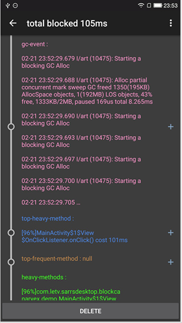
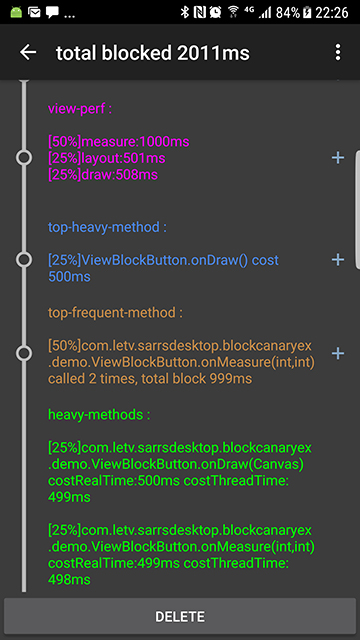
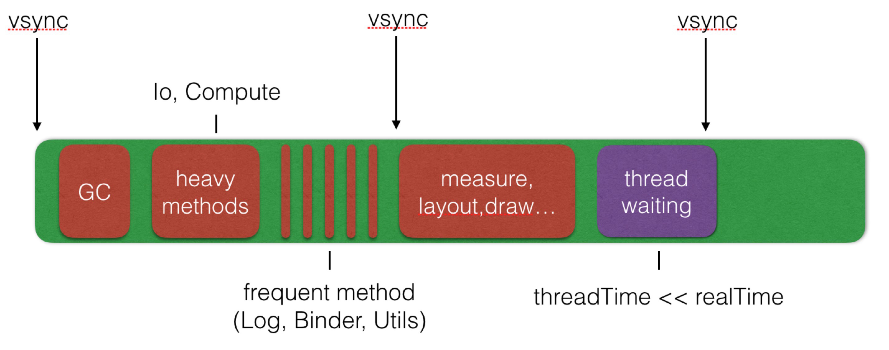

[English doc](https://github.com/lqcandqq13/BlockCanaryEx/blob/master/README.md)<br/>

BlockCanaryEx
=============
记录主线程中执行的所有方法和它们的执行时间，当app卡顿时，将所有耗时方法直接展示给开发者，节省开发者定位卡顿问题的时间。
此项目基于 [BlockCanary](https://github.com/markzhai/AndroidPerformanceMonitor)。




BlockCanaryEx和BlockCanary的区别如下
-------------
- BlockCanaryEx的运行时代码修改自BlockCanary，ui和大部分功能基本一致;
- BlockCanaryEx添加了方法采样，知道主线程中所有方法的执行时间和执行次数;
- 当应用卡顿时，BlockCanaryEx更关注app代码中，哪些方法耗时最多，重点记录和显示这些耗时方法；
- 添加了gc采样，当应用卡顿时，我们可以知道卡顿时是否发生了gc，以及gc的时间；
- 监控view性能，计算卡顿时，view的measure,layout,draw消耗的时间。

卡顿源
-------------



安装
-------------
root build.gradle
```groovy
buildscript {
    repositories {
        jcenter()
    }
    dependencies {
        classpath 'com.android.tools.build:gradle:1.5.0' //version must >= 1.5.0
        classpath 'com.letv.sarrsdesktop:BlockCanaryExPlugin:0.9.9.5'
    }
}
```
model build.gradle
```groovy
apply plugin: 'blockcanaryex'
```

```groovy
debugCompile 'com.letv.sarrsdesktop:BlockCanaryExJRT:0.9.9.4'
releaseCompile 'com.letv.sarrsdesktop:BlockCanaryExJRTNoOp:0.9.9.4'
testCompile 'com.letv.sarrsdesktop:BlockCanaryExJRTNoOp:0.9.9.4'
```

基础使用
-------------

在应用application attachBaseContext()时，第一时间初始化BlockCanaryEx

```java
public class TestApplication extends Application {
    @Override
    public void attachBaseContext(Context context) {
        super.attachBaseContext(context);
        boolean isInSamplerProcess = BlockCanaryEx.isInSamplerProcess(this);
        if(!isInSamplerProcess) {
            BlockCanaryEx.install(new Config(this));
        }
        if(!isInSamplerProcess) {
            //your code start here
        }
    }
}
```

done，现在BlockCanaryEx已经在app debug模式中生效。

进阶使用
-------------

BlockCanaryEx在编译期，通过字节码注入，将方法采样器注入到你的代码中。字节码注入的代码范围，默认是你的project源码和subproject源码。project libs、subProject libs以及external libs默认是不注入方法采样器的。如果你想扩大你的方法采样，监测更多的方法性能，你可以在build.gradle中修改字节码注入的范围。

```groovy
  apply plugin: 'blockcanaryex'

  block {
      debugEnabled true //在debug模式下开启方法采样，默认为true
      releaseEnabled false //在release模式下开启方法采样，默认为false
      excludePackages = [] //不希望进行方法采样的包名, 比如: ['com.android', 'android.support']
      excludeClasses = [] //不希望进行方法采样的类名
      includePackages = [] //指定开启方法采样的包名，如果不为空，则其它没有包括进来的包都不会开启方法采样

      scope {
          project true //开启主项目代码方法采样，默认为true
          projectLocalDep false //开启主项目本地libs代码(比如.jar)方法采样，默认为false,
          subProject true //开启子项目代码方法采样，默认为true
          subProjectLocalDep false //开启子项目本地libs方法采样，默认为false
          externalLibraries false //开启第三方libs方法采样，默认为false
      }
  }
 ```

你也可能以通过覆写更多的Config方法，来定制BlockCanaryEx的运行时表现。

```java
  public class TestApplication extends Application {
      @Override
      public void onCreate() {
          super.onCreate();
          BlockCanaryEx.install(new Config(this) {
              /**
               * If need notification to notice block.
               *
               * @return true if need, else if not need.
               */
              public boolean displayNotification() {
                  return true;
              }

              /**
               * judge whether the loop is blocked, you can override this to decide
               * whether it is blocked by your logic
               *
               * @param costRealTimeMs in mills
               * @param costThreadTimeMs in mills
               * @param creatingActivity current creatingActivity class name, nullable
               * @param isApplicationCreating is application creating
               * @param inflateCostTimeMs view inflating time in mills
               * @return true if blocked, else false
               */
              public boolean isBlock(long costRealTimeMs, long costThreadTimeMs,
                                         String creatingActivity, boolean isApplicationCreating, long inflateCostTimeMs) {
                  if(creatingActivity != null || isApplicationCreating) {
                      return costRealTimeMs > 250L;
                  } else {
                      return costRealTimeMs > 100L && costThreadTimeMs > 8L;
                  }
              }

              /**
               * judge whether the method is heavy method, we will print heavy method in log
               *
               * Note: running in none ui thread
               *
               * @param methodInfo {@link MethodInfo}
               * @return true if it is heavy method, else false
               */
              public boolean isHeavyMethod(MethodInfo methodInfo) {
                  return (methodInfo.getCostThreadTime() > 0L && methodInfo.getCostRealTimeMs() > 0L)
                          || methodInfo.getCostRealTimeMs() > 2L;
              }

              /**
               * judge whether the method is called frequently, we will print frequent method in log
               *
               * Note: running in none ui thread
               *
               * @param frequentMethodInfo the execute info of same method in this loop {@link FrequentMethodInfo}
               * @return true if it is frequent method, else false
               */
              public boolean isFrequentMethod(FrequentMethodInfo frequentMethodInfo) {
                  return frequentMethodInfo.getTotalCostRealTimeMs() > 1L && frequentMethodInfo.getCalledTimes() > 1;
              }

              /**
               * we will save block log to sdcard by default, if you want to disable this, just return false
               *
               * Warning: if save log disabled, new BlockInfo will not be displayed in DisplayActivity
               *
               * Note: running in none ui thread
               *
               * @return false to disable save log
               */
              public boolean enableSaveLog() {
                  return true;
              }

              /**
               * Path to save log, like "/blockcanary/", will save to sdcard if can. if we can't save log to sdcard (eg: no permission),
               * else we will try to save to "${context.getExternalFilesDir("BlockCanaryEx")}${provideLogPath()}", if we failed too,
               * we will save to "${context.getFilesDir()${provideLogPath()}"}"
               *
               * Note: running in none ui thread
               *
               * @return path of log files
               */
              public String provideLogPath() {
                  return "/blockcanaryex/" + getContext().getPackageName() + "/";
              }

              /**
               * Network type to record in log, you should impl this if you want to record this
               *
               * @return {@link String} like 2G, 3G, 4G, wifi, etc.
               */
              public String provideNetworkType() {
                  return "unknown";
              }

              /**
               * unique id to record in log, you should impl this if you want to record this
               *
               * @return {@link String} like imei, account id...
               */
              public String provideUid() {
                  return "unknown";
              }

              /**
               * Implement in your project.
               *
               * @return Qualifier which can specify this installation, like version + flavor.
               */
              @TargetApi(Build.VERSION_CODES.DONUT)
              public String provideQualifier() {
                  PackageInfo packageInfo = ProcessUtils.getPackageInfo(getContext());
                  ApplicationInfo applicationInfo = getContext().getApplicationInfo();
                  if(packageInfo != null) {
                      return applicationInfo.name + "-" + packageInfo.versionName;
                  }
                  return "unknown";
              }

              /**
               * Block listener, developer may provide their own actions
               *
               * @param blockInfo {@link BlockInfo}
               */
              @Override
              public void onBlock(BlockInfo blockInfo) {
              }
          });
      }
  }
 ```

License
-------

     Licensed under the Apache License, Version 2.0 (the "License");
     you may not use this file except in compliance with the License.
     You may obtain a copy of the License at

        http://www.apache.org/licenses/LICENSE-2.0

     Unless required by applicable law or agreed to in writing, software
     distributed under the License is distributed on an "AS IS" BASIS,
     WITHOUT WARRANTIES OR CONDITIONS OF ANY KIND, either express or implied.
     See the License for the specific language governing permissions and
     limitations under the License.
